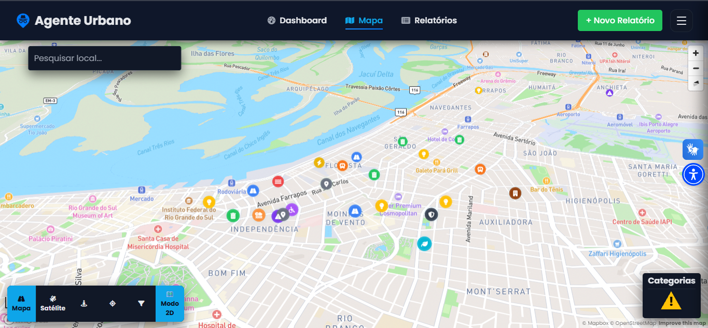
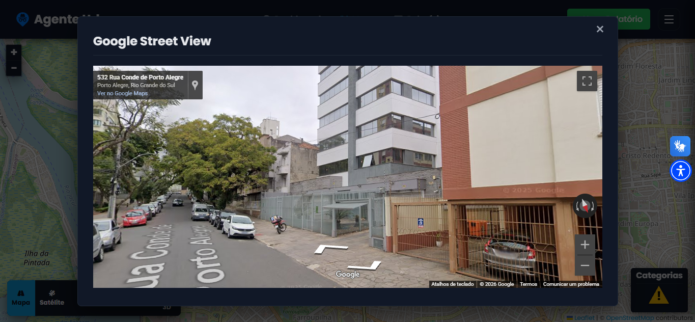
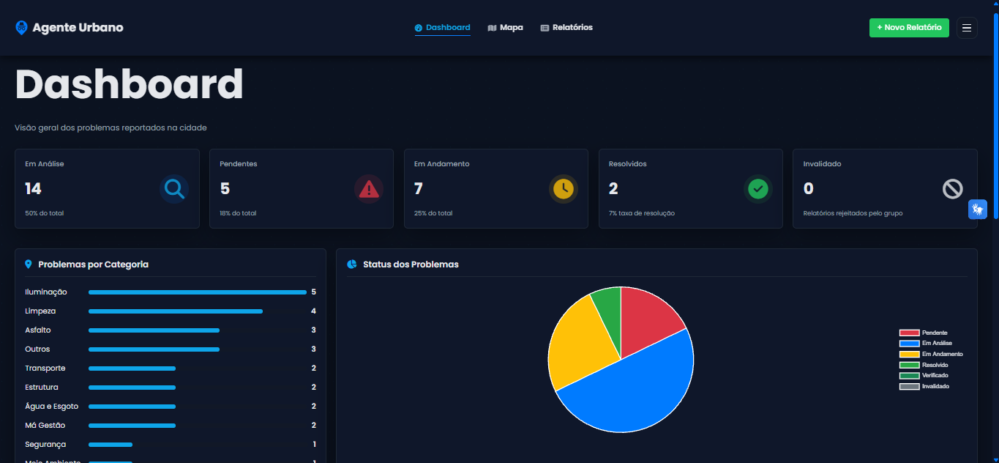
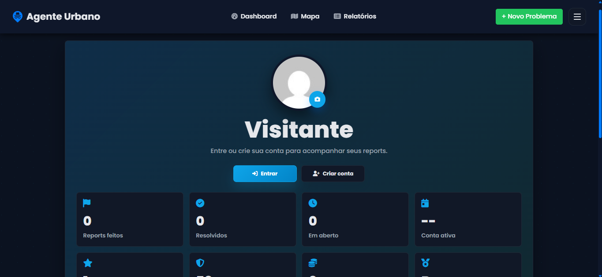

<p align="center">
  
</p>

<p align="center">
  
</p>


<p align="center">
  <strong>Agente Urbano</strong> — Um ecossistema de cartografia digital para visualização espacial, reporte de ocorrências em tempo real e monitorização de infraestruturas municipais.
</p>

<p align="center">
  
  
  
  
  
  
  
  
  
</p>

## Licença

Este projeto está licenciado sob a GNU General Public License v3.0 (GPL-3.0).

Consulte o arquivo LICENSE para mais informações.
---

## 📑 Introdução

O crescimento acelerado e, por vezes, desordenado das malhas urbanas contemporâneas impõe desafios complexos à gestão pública e à qualidade de vida dos cidadãos. Problemas associados à manutenção da infraestrutura, falhas de sinalização, bloqueios de vias e avarias nos serviços de utilidade pública frequentemente permanecem invisíveis ou demoram a ser reportados devido à fragmentação dos canais tradicionais de atendimento. O **Agente Urbano** nasce da necessidade imperativa de centralizar, georreferenciar e dar transparência a estas ocorrências, mitigando a assimetria de informação entre a população e os órgãos decisores.

A relevância do acesso simplificado a dados territoriais reside na capacidade de transformar cidadãos comuns em sensores ativos do espaço urbano. Ao disponibilizar uma plataforma intuitiva assente em tecnologias web avançadas, o ecossistema democratiza a leitura do espaço público, eliminando barreiras técnicas complexas comuns em sistemas GIS institucionais. Qualquer utilizador, independentemente do seu nível de literacia digital, pode interagir com mapas detalhados, registar anomalias espaciais e visualizar o estado de conservação do seu bairro.

A arquitetura do **Agente Urbano** foi desenhada com foco obsessivo em desempenho e eficiência. Utilizando renderização vetorial no lado do cliente por intermédio do MapLibre GL JS e uma camada de dados altamente otimizada em GeoJSON, o sistema garante uma navegação fluida, transições de mapas instantâneas e tempos de resposta mínimos no carregamento de pontos críticos, mesmo em ligações de largura de banda restrita ou dispositivos móveis de gama média.

---

## 👁️ Visão Geral

O **Agente Urbano** opera sob a filosofia de que o mapeamento aberto e comunitário é um direito fundamental para o desenvolvimento de cidades sustentáveis e inteligentes. O projeto adota uma abordagem descentralizada, fornecendo as ferramentas necessárias para mapear incidentes, extrair métricas de zonas críticas e fornecer dados estruturados que possam servir de base para intervenções urbanísticas pontuais ou planeamentos estratégicos de larga escala.

### Princípios Orientadores

* **Soberania dos Dados**: Fomento ao ecossistema de dados abertos através da integração nativa com infraestruturas OpenStreetMap.
* **Transparência Radical**: Ocorrências registadas ficam publicamente acessíveis na malha cartográfica, impulsionando a fiscalização cidadã.
* **Frugalidade Tecnológica**: Elevada capacidade de processamento sem dependência de ambientes pesados ou frameworks proprietários excessivos.

### Público-Alvo

A plataforma estende o seu valor a múltiplos perfis de utilizadores: **habitantes locais** que buscam melhorias imediatas no seu ambiente habitacional; **urbanistas e engenheiros civis** interessados na distribuição espacial das falhas infraestruturais; e **gestores públicos** focados na otimização de rotas de reparação e alocação orçamental de serviços públicos.

---

## 🎯 Objetivos Estratégicos

### 🌎 Centralizar informações urbanas
Agrupar os fluxos de notificações e dados geográficos espalhados por diferentes setores num único centro operacional visual, reduzindo o tempo entre a identificação do problema e a sua efetiva resolução.

### 🗺️ Facilitar a interpretação do território
Traduzir coordenadas complexas e bases relacionais extensas em camadas visuais inteligíveis, permitindo leituras rápidas da densidade de problemas por zonas geográficas (Clusters).

### 📊 Democratizar os dados municipais
Garantir exportações em padrões abertos e legíveis por máquina (GeoJSON, JSON) para que universidades, investigadores e desenvolvedores independentes possam auditar ou estender os dados coletados.

### ⚡ Garantir o máximo desempenho
Estruturar o fluxo de dados para que os polígonos urbanos, malhas viárias e marcadores dinâmicos processem via aceleração gráfica por hardware através de WebGL, prevenindo engasgos na interface.

---

## 🚀 Funcionalidades

O sistema divide-se em componentes lógicos robustos, modelados para oferecer uma experiência de uso imersiva.

<table width="100%">
  <tr>
    <td width="50%" valign="top">
      <h3>📍 Mapa Interativo Vetorial</h3>
      <p>Renderização de mapas de alta fidelidade baseados em vetores com capacidade para alternar estilos de visualização, ativar visualizações de satélite e sobrepor dados coropléticos.</p>
    </td>
    <td width="50%" valign="top">
      <h3>🛠️ Ferramentas de Filtragem Avançada</h3>
      <p>Consultas espaciais e temporais detalhadas. Filtre incidentes por gravidade, estado operacional, tipo de infraestrutura ou data de abertura através de controlos laterais fluidos.</p>
    </td>
  </tr>
  <tr>
    <td width="50%" valign="top">
      <h3>📊 Dashboard de Métricas</h3>
      <p>Gráficos consolidados e indicadores-chave de desempenho (KPIs) exibindo estatísticas de reparações efetuadas, tempo médio de resposta e os pontos com maior densidade de reclamações.</p>
    </td>
    <td width="50%" valign="top">
      <h3>⚙️ Painel de Configurações do Sistema</h3>
      <p>Customização integral da experiência cartográfica, gestão de chaves de API das camadas de mapas, parametrização de limites geográficos municipais e perfis administrativos.</p>
    </td>
  </tr>
</table>

---

## 🛠️ Tecnologias Utilizadas

| Tecnologia | Finalidade |
| :--- | :--- |
| **HTML5** | Estruturação semântica e acessibilidade de todas as visualizações do ecossistema. |
| **CSS3** | Estilização avançada com variáveis nativas e layouts fluidos para total compatibilidade com ecrãs. |
| **JavaScript (ES6+)** | Lógica da aplicação, manipulação do DOM e gestão de estado das camadas geográficas. |
| **PHP** | Motor de back-end responsável pelo encaminhamento de requisições e persistência de dados. |
| **MapLibre GL JS** | Renderização vetorial acelerada por GPU para mapas dinâmicos e fluidos. |
| **OpenStreetMap** | Provedor de dados espaciais e cartografia de base livre. |
| **MySQL** | Base de dados relacional para armazenamento seguro de registos e tabelas do sistema. |
| **GeoJSON** | Padrão aberto de intercâmbio de dados geográficos para rápida renderização de geometrias. |

---

## 📐 Arquitetura do Sistema

O **Agente Urbano** utiliza uma topologia cliente-servidor otimizada para a transferência ágil de ficheiros geográficos vectoriais estruturados:

```
+------------------------------------------------------------------------+
|                      CAMADA CLIENTE (Navegador)                        |
|                                                                        |
|   +-------------------+    +--------------------+    +-------------+   |
|   |   Interface UI    |    |  MapLibre GL JS    |    | Dashboard   |   |
|   |  (HTML5 / CSS3)   |    | (Camadas Vetoriais)|    | (Módulos JS)|   |
|   +---------+---------+    +---------+----------+    +------+------+   |
+-------------|------------------------|----------------------|----------+
              |                        |                      |
              | Requisições HTTP Async | Eventos Geo          | Dados JSON
              v                        v                      v
+------------------------------------------------------------------------+
|                      CAMADA SERVIDOR (Back-End)                        |
|                                                                        |
|   +----------------------------------------------------------------+   |
|   |                     API / Controladores PHP                     |   |
|   |        (Validação, Filtros Espaciais, Processamento)           |   |
|   +-------------------------------|--------------------------------+   |
+-----------------------------------|------------------------------------+
                                    |
                                    | Consultas SQL / I/O Ficheiros
                                    v
+------------------------------------------------------------------------+
|                      CAMADA DE PERSISTÊNCIA                            |
|                                                                        |
|         +-----------------------+     +-----------------------+        |
|         |  Base de Dados MySQL  |     |  Repositório GeoJSON  |        |
|         +-----------------------+     +-----------------------+        |
+------------------------------------------------------------------------+
```

---

## 📁 Estrutura de Pastas

A organização interna do código reflete a separação clara de responsabilidades entre lógica de negócio, assets e componentes visuais:

```
agente-urbano/
├── imagens/                # Diretório de assets de imagens estáticas do sistema
├── node_modules/           # Dependências e pacotes externos gerenciados via npm
├── secret/                 # Arquivos de configurações sensíveis e chaves de proteção
├── uploads/                # Armazenamento de mídias enviadas pelos usuários nos relatórios
├── api.js                  # Lógica de integração e chamadas assíncronas no front-end
├── api.php                 # Core do back-end para processamento e respostas de requisições
├── assistente.css          # Estilização das interfaces e janelas do módulo assistente
├── assistente.js           # Comportamento interativo e manipulação do assistente na tela
├── assistente_api.php      # Regras de negócio e processamento de dados do assistente
├── chat.js                 # Gerenciamento de mensagens e painel de comunicação fluida
├── dashboard.php           # Painel de monitorização executiva e indicadores (KPIs)
├── detalhes-relatorio.php  # Visualização aprofundada de um reporte urbano específico
├── gamificacao.php         # Módulo de engajamento e conquistas do cidadão agente
├── index.php               # Ponto de entrada da aplicação (Página Inicial)
├── mapa.php                # Módulo central de geoprocessamento e cartografia vetorial
├── position.php            # Gerenciamento de geolocalização e captura de coordenadas GPS
├── profile.php             # Painel de controle e dados do perfil do usuário logado
├── README.md               # Documentação principal e guia de apresentação do repositório
├── recompensas.php         # Sistema de incentivo e distribuição de recompensas urbanas
├── relatorios.php          # Visualização geral e agrupamento de todas as ocorrências
├── report_owners.json      # Mapeamento e controle de responsáveis pelas resoluções
├── script.js               # Comportamento global e interatividades gerais do DOM
├── settings.php            # Configurações de sistema e chaves operacionais
├── style.css               # Folha de estilo CSS global e padronização visual
├── ui.js                   # Controle de componentes visuais, transições e animações
├── users.json              # Configurações locais ou mock de dados de usuários
└── usuario.php             # Área individual e gerenciamento de ações do usuário
```

---

## ⚡ Instalação e Execução

### Pré-requisitos

Antes de iniciar, certifique-se de que possui os seguintes ambientes configurados na sua máquina:
* Servidor Web local com suporte a **PHP 8.0** ou superior (Apache, Nginx, ou ambientes integrados como XAMPP/Docker).
* Servidor de Base de Dados **MySQL** operacional.

### Passo a Passo

1.  **Clonar o Repositório**
    ```bash
    git clone https://github.com/seu-utilizador/agente-urbano.git
    cd agente-urbano
    ```

2.  **Configurar a Base de Dados**
    * Aceda ao seu gestor de base de dados (ex: phpMyAdmin).
    * Crie uma nova base de dados chamada `agente_urbano`.
    * Importe o ficheiro de estrutura (caso exista um dump SQL básico disponível) ou execute as queries estruturais necessárias para as tabelas de ocorrências urbanas.

3.  **Parametrizar a Conexão**
    * Navegue até `config/database.php`.
    * Edite as credenciais de acesso para corresponderem ao seu ambiente local:
    ```php
    define('DB_HOST', 'localhost');
    define('DB_NAME', 'agente_urbano');
    define('DB_USER', 'seu_usuario');
    define('DB_PASS', 'sua_senha');
    ```

4.  **Iniciar o Servidor**
    * Mova a pasta do projeto para o diretório raiz do seu servidor web (ex: `htdocs` ou `www`).
    * Alternativamente, inicie o servidor interno do PHP dentro da pasta raiz do projeto:
    ```bash
    php -S localhost:8080
    ```
    * Abra o seu navegador e aceda a `http://localhost:8080`.

---

## 📖 Como Utilizar

O ecossistema **Agente Urbano** disponibiliza caminhos bem definidos para interagir com o território urbano mapeado:

1.  **Exploração Visual (Página Inicial e Mapa)**: Navegue pela malha urbana aproximando o zoom para inspecionar os marcadores dispostos nas ruas. Cada cor de marcador representa uma tipologia de ocorrência específica.
2.  **Registo de Anomalias**: Clique diretamente sobre o mapa no local exato da ocorrência encontrada na realidade. Preencha o formulário integrado fornecendo descrição, categoria do problema e submeta. O sistema processa o ponto e atualiza a camada GeoJSON.
3.  **Filtragem Cirúrgica**: Utilize o ecrã de **Ferramentas** para isolar áreas com maior necessidade de intervenção, exportando os resultados limpos para análises externas.
4.  **Análise de Métricas**: O ecrã de **Dashboard** consolida os dados e apresenta os bairros que exigem atenção prioritária das equipas de infraestrutura através de leituras gráficas diretas.

---

## 📸 Capturas de Ecrã (Placeholders)

<p align="center">
  <strong>Página Inicial do Ecossistema</strong><br>
  
</p>

<p align="center">
  <strong>Módulo do Mapa Interativo Vetorial</strong><br>
  
</p>

<p align="center">
  <strong>Ferramentas de Análise Espacial</strong><br>
  
</p>

<p align="center">
  <strong>Dashboard de Monitorização e KPIs</strong><br>
  
</p>

<p align="center">
  <strong>Configurações do Sistema</strong><br>
  
</p>

---
<!-- ========================================= -->
<!-- Demonstração -->
<!-- ========================================= -->

<h2 align="center">
    🎬 Demonstração
</h2>

<p align="center">
    <em>Veja o Agente Urbano em funcionamento antes mesmo de acessar o projeto.</em>
</p>

<p align="center">
    
</p>

<p align="center">

<a href="https://agenteurbano.page.gd/" target="_blank">
    
</a>
&nbsp;&nbsp;
</p>
<p align="center">
Clique nos botões acima para explorar o projeto em tempo real.
</p>

---

## 🧠 Filosofia do Projeto

> *"A cidade não é um aglomerado de pedras, betão e asfalto; é um organismo dinâmico constituído pelas relações entre o espaço físico e os indivíduos que o habitam."*

Compreender as cidades é o primeiro passo para as transformar. O **Agente Urbano** assenta na convicção de que os dados geográficos e o mapeamento detalhado de infraestruturas não devem ser restritos a gabinetes fechados ou softwares corporativos inacessíveis. Quando os dados urbanos são libertados e visualizados de forma límpida, as prioridades emergem organicamente. O projeto atua como o elo que faltava para dar voz às carências das vias públicas, permitindo que a tecnologia sirva como catalisadora de espaços urbanos mais integrados, resilientes e transparentes.

---

## 🤝 Contribuindo

Contribuições de código, relatórios de erros e melhorias de design são extremamente bem-vampiras. Para manter a estabilidade do ecossistema, siga o protocolo de desenvolvimento:

1.  Faça um **Fork** do projeto.
2.  Crie uma **Branch** para a sua funcionalidade (`git checkout -b feature/nova-camada-mapa`).
3.  Efetue os seus **Commits** estruturados com mensagens claras (`git commit -m 'Adiciona suporte a polígonos no GeoJSON'`).
4.  Submeta um **Push** para a sua Branch (`git push origin feature/nova-camada-mapa`).
5.  Abra um **Pull Request** detalhando as alterações propostas e os testes realizados.

---

